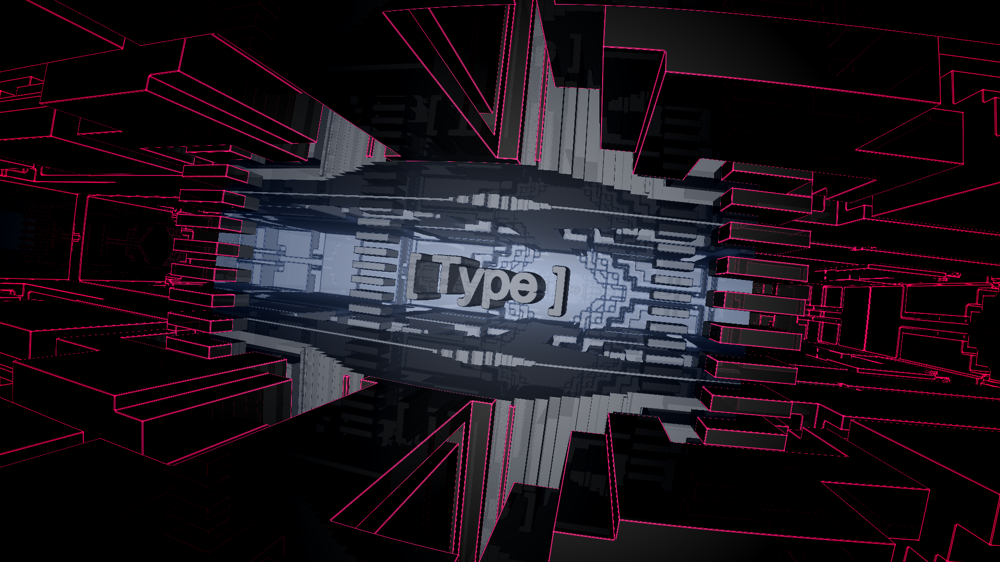

# [ Type ]

by FMS_Cat



WebGL Demo  
9,105 bytes  

2nd Place @ TokyoDemoFest Combined PC Compo  
[🍻🚨🚀 Play now! 🚀🚨🍻](http://fms-cat.github.io/type/)
[🌵👾📼 Watch on YouTube 📼👾🌵](https://youtu.be/I4OJccraqR4)  
[🔦🍖💖 Pouet prod 💖🍖🔦](http://www.pouet.net/prod.php?which=66963)  

---

### Raymarching WordArt!
- I achieve the greetings part on small intro! yay!
  - did any attempt there?
- make distance field texture of words using canvas2D and shader

### Super Glitch!
- audio-visual sync sick glitch fx
- procedural music using shader, so that I could use same glitch timing function on both shaders
- also `String.fromCharCode( pow( random(), 4 ) * 65536 )` is fun

### And so many other features!
- IFS fractal geometry
- edge detection using gap of normals
  - red line on blue background is reallllly cool
- wtf blue portally something (spins with snare shot!)
- gooooood snare sound

### minifier hell!
- "To minify, you have to code it longer (means more beautiful)"
- because beautiful code is easy to pattern matching
- `while( true ) { say( "Thank You" ); }`: [Shader Minifier by Ctrl+Alt+Test]()
- also [/packer/](http://dean.edwards.name/packer/) is good (but finally it did only 5% compression...🙀)
- I had no time! if I have plenty of time, I can minify it more...

### Drink!
- i am addicted for gin and kahlua
- chai tea is also good, but hard to find

### Food!
- which do you like?
  - doritos
  - cheetos
- btw i like chips

### Greetings!
```JavaScript
var greetings = [
  'ASD',
  'Ctrl-Alt-Test',
  'doxas',
  'gyabo',
  'MetroGirl',
  'nikq::club',
  'orange',
  'primitive',
  'quite',
  'Radium Software',
  'rgba',
  'RTX1911',
  'SystemK',
  'xplsv'
];

// and everyone who participated in TokyoDemoFest2016!! Thank you thank you!!
// and apologize to fukuchi-sensei, I will immediately start make the poster to symposium
```
